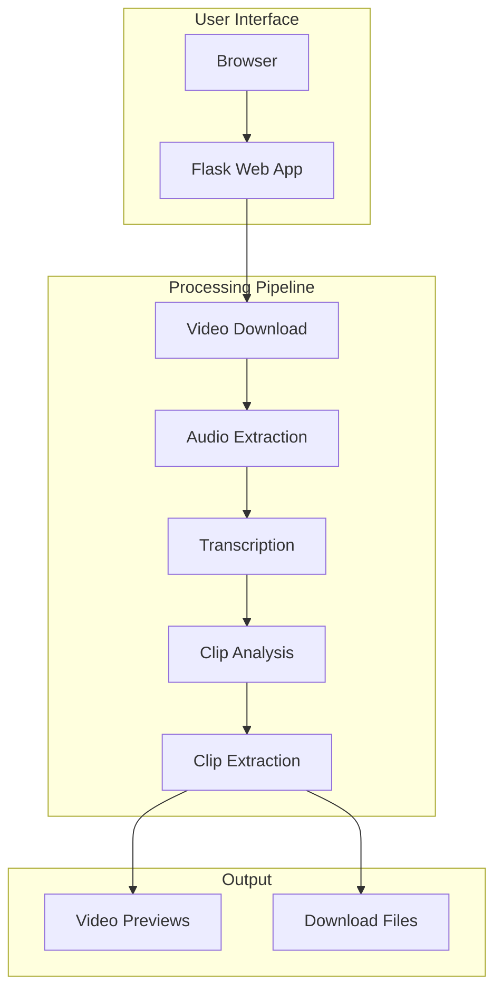
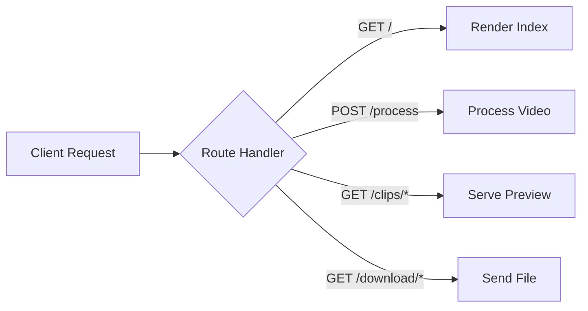
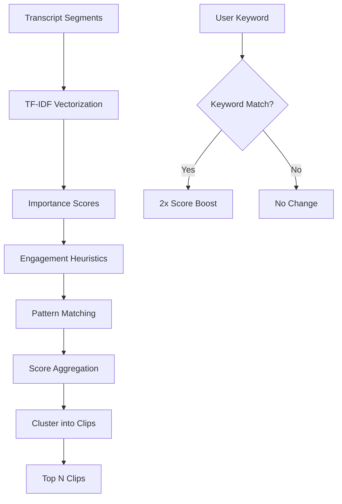
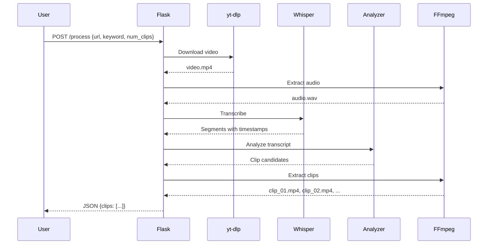

# Architecture Overview

This document describes the architecture of AI Video Clipper, explaining how the different components work together to extract engaging clips from YouTube videos.

## System Overview



## Core Components

### 1. Web Layer (Flask)

**Location**: `app.py` (routes section)

The Flask application handles:
- **Static file serving** - CSS, JavaScript, clip previews
- **API endpoints** - REST API for processing requests
- **Template rendering** - Jinja2 templates for UI



### 2. Video Download (yt-dlp)

**Function**: `download_youtube_video()`

Downloads YouTube videos in MP4 format with these considerations:
- Format selection: `best[ext=mp4]`
- No playlist downloading
- Error handling with cleanup

### 3. Audio Extraction (FFmpeg)

**Function**: `extract_audio()`

Converts video to audio optimized for speech recognition:
- Output: 16kHz mono WAV
- Codec: PCM 16-bit

```bash
ffmpeg -i video.mp4 -vn -acodec pcm_s16le -ar 16000 -ac 1 audio.wav
```

### 4. Transcription (faster-whisper)

**Function**: `transcribe_audio()`

Uses the `tiny` Whisper model for fast CPU-based transcription:
- Word-level timestamps enabled
- Auto language detection
- Optimized for Apple Silicon with int8 compute

### 5. Clip Analysis (TF-IDF + Heuristics)

**Function**: `analyze_transcript()`

The clip selection algorithm uses multiple scoring factors:



#### Scoring Factors

| Factor | Weight | Description |
|--------|--------|-------------|
| TF-IDF Score | 1.0x | Unique, important words |
| Keyword Match | 2.0x | Contains user's keyword |
| Question Detection | 1.3x | "How", "Why", "What" patterns |
| Importance Words | 1.4x | "important", "key", "crucial" |
| Examples | 1.3x | "for example", "such as" |
| Action Items | 1.3x | "tip", "trick", "solution" |

### 6. Title Generation

**Function**: `generate_clip_title()`

Creates descriptive titles from transcript content:
1. Removes filler words (um, uh, like, basically)
2. Extracts content words
3. Prioritizes keyword-containing phrases
4. Limits to 60 characters

### 7. Silence Detection

**Function**: `detect_silences()`

Uses FFmpeg's `silencedetect` filter to find natural pause points:

```bash
ffmpeg -i audio.wav -af 'silencedetect=noise=-35dB:d=0.3' -f null -
```

This ensures clips end at natural speech breaks, not mid-sentence.

### 8. Clip Extraction (FFmpeg)

**Function**: `extract_clips()`

Extracts video segments with optimized settings:

```bash
ffmpeg -ss START -i video.mp4 -t DURATION \
    -c:v libx264 -preset ultrafast -crf 23 \
    -c:a aac -b:a 128k \
    -movflags +faststart \
    output.mp4
```

Key optimizations:
- `-ss` before `-i` for fast seeking
- `ultrafast` preset for speed
- `+faststart` for web playback

## Data Flow



## File Structure

```
ai-video-clipper/
├── app.py              # Main Flask application
├── requirements.txt    # Python dependencies
├── templates/
│   └── index.html      # Frontend UI
├── static/
│   └── style.css       # Styles
├── clips/              # Generated clips (gitignored)
├── videos/             # Downloaded videos (temp)
├── audio/              # Extracted audio (temp)
└── logs/               # Processing logs
```

## Performance Considerations

### Apple Silicon Optimization

- **Whisper**: Uses `int8` compute type for efficient CPU inference
- **FFmpeg**: `ultrafast` preset minimizes encoding time
- **Seeking**: Input seeking (`-ss` before `-i`) for fast clip extraction

### Memory Management

- Audio files cleaned up after transcription
- Video files cleaned up after clip extraction
- Clips organized by YouTube ID for easy cleanup

## Error Handling

The application handles errors at each stage:

1. **Invalid URL** - Returns 400 with error message
2. **Download failure** - Cleanup partial files
3. **Transcription failure** - Log error, cleanup
4. **No clips found** - Returns 404 with suggestion
5. **FFmpeg failure** - Skip clip, continue others

## Future Improvements

See [GitHub Issues](https://github.com/mohitmishra786/ai-video-clipper/issues) for planned features:

- [ ] Real-time progress updates via WebSocket
- [ ] Subtitle overlay option
- [ ] Multiple video processing queue
- [ ] Custom clip duration settings
- [ ] Scene change detection
